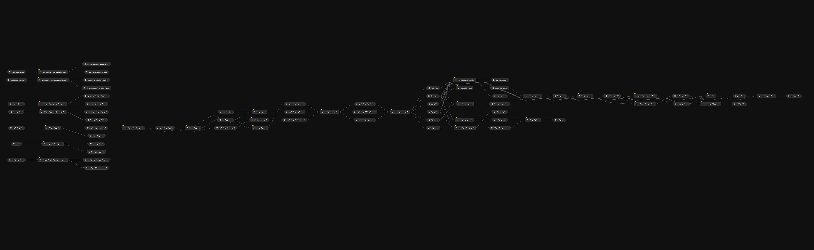
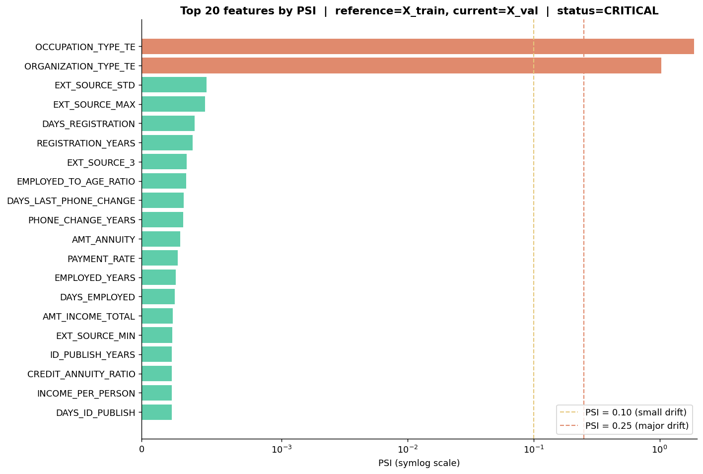
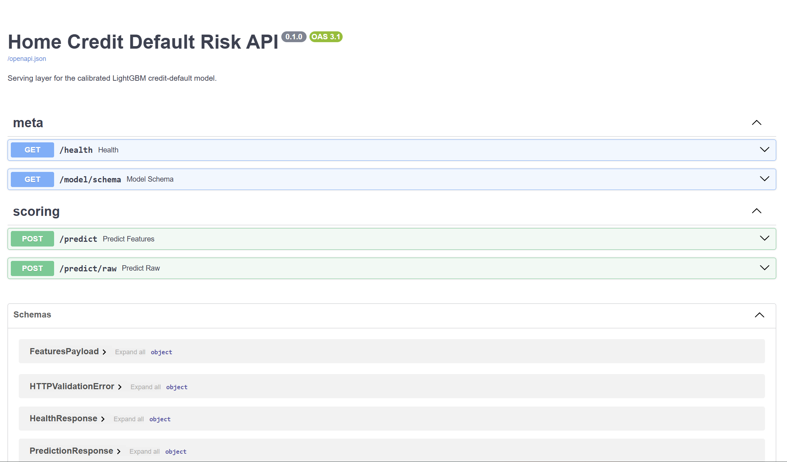
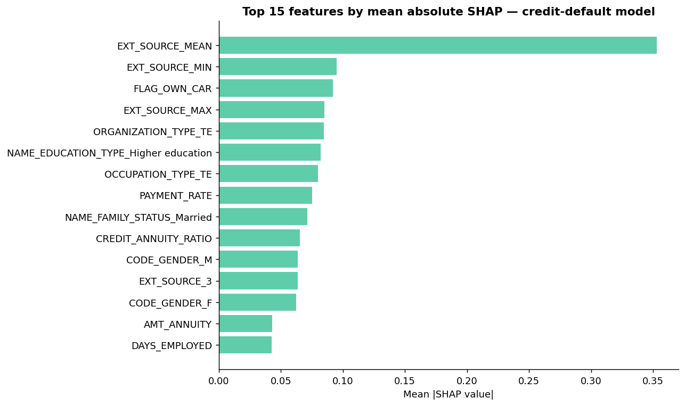

<div align="center">

# Home Credit Default Risk &mdash; MLOps Pipeline

**Proof-of-concept of a production-grade ML pipeline for credit risk scoring.**
Built on Kedro 1.4 &middot; MLflow 3 &middot; LightGBM &middot; FastAPI &middot; Docker.

[](https://github.com/tiagoslantunes/home-credit-mlops/actions/workflows/quality.yml)
[](https://www.python.org/)
[](https://kedro.org)
[](https://mlflow.org/)
[](https://fastapi.tiangolo.com/)
[](https://www.docker.com/)
[](LICENSE)
[](https://github.com/marianamelo0/home-credit-mlops)

</div>

> [!IMPORTANT]
> This is Tiago Antunes's portfolio fork of the collaborative
> [Group 1 repository maintained by Mariana Melo](https://github.com/marianamelo0/home-credit-mlops).
> Tiago's original contribution covers data splitting, model selection, model training,
> MLflow, Optuna, and SHAP. Full team attribution is preserved below.

---

## Highlights

- Eight modular Kedro pipelines, runnable end-to-end or one at a time.
- Great Expectations data gate before any modelling step touches the raw CSVs.
- Stratified split **before** cleaning, so cleaning artefacts are fitted on train only.
- GridSearchCV + Optuna TPE tracked in MLflow, with SHAP explanations per run.
- PSI + Evidently drift monitoring with an alert payload.
- The same calibrated model served through FastAPI and packaged in Docker.

---

## Table of contents

1. [Highlights](#highlights)
2. [Project overview](#project-overview)
3. [MLOps capability map](#mlops-capability-map)
4. [Architecture](#architecture)
5. [Quick start](#quick-start)
6. [Run the pipelines](#run-the-pipelines)
7. [Demo Block D &mdash; Drift](#demo-block-d--drift)
8. [Demo Block E &mdash; Serving](#demo-block-e--serving)
9. [Quality checks](#quality-checks)
10. [Results](#results)
11. [Authors](#authors)
12. [Tech stack](#tech-stack)
13. [Provenance and usage](#provenance-and-usage)
14. [License](#license)

---

## Project overview

The Kaggle [Home Credit Default Risk](https://www.kaggle.com/competitions/home-credit-default-risk) task: predict whether a credit applicant with limited credit history will repay (`TARGET = 0`) or default (`TARGET = 1`).

This repository implements that prediction problem as an **end-to-end MLOps pipeline** &mdash; not a Kaggle-leaderboard model. The grading rubric (and the focus of this work) is the *quality of the pipeline*: modularity, reproducibility, data tests, experiment tracking, explainability, serving, and drift monitoring.

See the [model card](MODEL_CARD.md) for intended use, evaluation context,
limitations, fairness considerations, and production-readiness boundaries. The
original [course assignment brief](docs/MLOps_project.pdf) is retained for context.

---

## MLOps capability map

Each MLOps capability is implemented and traceable to its code and generated artefacts:

| # | Component | Stack | Where to look |
|---|---|---|---|
| 1 | **Unit data tests** | Great Expectations 1.18 | [`pipelines/data_quality`](src/home_credit_mlops/pipelines/data_quality) &middot; reports in `data/08_reporting/*_quality_report.csv` |
| 1b | **Feature store** | Hopsworks (optional) | [`data_feat_engineering.to_feature_store`](src/home_credit_mlops/pipelines/data_feat_engineering/nodes.py) &middot; separate [`requirements-feature-store.txt`](requirements-feature-store.txt) environment &middot; no-op when no API key |
| 2 | **Experimentation + versioning** | MLflow 3 + Optuna 3 | [`pipelines/model_selection`](src/home_credit_mlops/pipelines/model_selection) &middot; [`pipelines/model_train`](src/home_credit_mlops/pipelines/model_train) &middot; runs in `mlflow.db` / `mlruns/` |
| 3 | **Metrics + explainability** | scikit-learn metrics + SHAP 0.52 | [`generate_shap_explanations`](src/home_credit_mlops/pipelines/model_train/nodes.py) &middot; `data/08_reporting/shap_importance.csv` |
| 4 | **Model serving + containers** | FastAPI + Docker | [`app/main.py`](app/main.py) &middot; [`Dockerfile`](Dockerfile) |
| 5 | **Data drift** | Evidently 0.7 + Population Stability Index | [`pipelines/data_drifts`](src/home_credit_mlops/pipelines/data_drifts) &middot; HTML report + alerts JSON in `data/08_reporting/` |

---

## Architecture

Eight modular Kedro pipelines that can run end-to-end (`kedro run`) or individually (`kedro run --pipeline=<name>`).



```text
data_quality        -- validates raw with Great Expectations expectations
   |
data_split          -- stratified 80/20 BEFORE cleaning to avoid leakage
   |
data_cleaning       -- fit cleaning artefact on TRAIN ONLY; apply to all splits
   |
data_feat_engineering -- financial ratios, OHE, target encoding, RFE selection
   |                                                 |
model_selection      -- GridSearchCV + Optuna TPE   data_drifts -- PSI + Evidently
   |
model_train          -- LightGBM + isotonic calibration + SHAP + MLflow registry
   |
model_predict        -- batch scoring   -->   FastAPI (app/main.py) + Docker
```

---

## Quick start

```powershell
# 1. Clone
git clone https://github.com/tiagoslantunes/home-credit-mlops.git
cd home-credit-mlops

# Optional: track the original group repository
git remote add upstream https://github.com/marianamelo0/home-credit-mlops.git

# 2. One-shot setup (creates .venv, installs every dependency, smoke-tests imports)
.\setup.ps1

# 3. Drop the 8 Kaggle CSVs into data/01_raw/
#    Source: https://www.kaggle.com/competitions/home-credit-default-risk/data
#    (Join the competition once to accept the rules, then "Download All".)

# 4. Activate the venv in any new shell
. .\.venv\Scripts\Activate.ps1

# 5. Run the full pipeline
$env:MPLBACKEND="Agg"
kedro run                           # ~15 min: from raw CSVs to a calibrated model

# 6. Serve the model
uvicorn app.main:app --port 8000    # browse http://localhost:8000/docs
```

> `$env:MPLBACKEND="Agg"` is required on Windows / headless setups so the
> SHAP plotting steps inside `model_train` do not try to open a GUI window.

---

## Run the pipelines

```powershell
kedro run                                       # end-to-end
kedro run --pipeline=data_quality               # Great Expectations gate
kedro run --pipeline=data_split                 # stratified 80/20 split
kedro run --pipeline=data_cleaning              # fit on train + apply to all
kedro run --pipeline=data_feat_engineering      # ratios + OHE + target encoding + RFE
kedro run --pipeline=model_selection            # ~10 min: GridSearch + Optuna over 5 models
kedro run --pipeline=model_train                # ~30 s: calibrated LightGBM + SHAP + MLflow
kedro run --pipeline=data_drifts                # PSI per feature + Evidently HTML + alerts
kedro run --pipeline=model_predict              # ~1 s: score X_val and write predictions
```

The pipeline DAG is visible in [Kedro Viz](https://kedro.org/kedro-viz):

```powershell
kedro viz run         # opens http://localhost:4141
```

---

## Demo Block D &mdash; Drift

Compare the training reference (`X_train`) against the current batch (`X_val`) on three layers: per-feature PSI, Evidently statistical tests, and an alert payload.



Interpretation thresholds (industry standard, Siddiqi, *Intelligent Credit Scoring*):

| PSI band | Interpretation |
|---|---|
| `< 0.10` | No significant change |
| `0.10 – 0.25` | Small to moderate shift &mdash; investigate |
| `≥ 0.25` | Major shift &mdash; model likely degraded |

A run is `critical` if **any** feature crosses `0.25` *or* if more than 30 % of features cross `0.10`. The alert is logged at WARNING / ERROR level so any sidecar (Slack, PagerDuty, etc.) can route it. Sample alert payload:

```json
{
  "status": "critical",
  "reason": "2 feature(s) with PSI >= 0.25",
  "drifted_features_count": 2,
  "major_drift_features_count": 2,
  "drifted_share": 0.04,
  "drifted_features": [
    { "feature": "OCCUPATION_TYPE_TE",   "psi": 1.88, "drift_level": "major" },
    { "feature": "ORGANIZATION_TYPE_TE", "psi": 1.03, "drift_level": "major" }
  ]
}
```

Open `data/08_reporting/drift_report.html` for the full interactive Evidently dashboard.

---

## Demo Block E &mdash; Serving

### Online API

`uvicorn app.main:app --port 8000` brings up a four-endpoint FastAPI service. The auto-generated Swagger UI at `http://localhost:8000/docs` makes the contract explorable without any client code:



| Method | Path | Purpose |
|---|---|---|
| GET | `/health` | Liveness probe + summary of loaded artefacts |
| GET | `/model/schema` | The 51 ordered feature names `/predict` expects |
| POST | `/predict` | Score an already-engineered feature vector (production contract) |
| POST | `/predict/raw` | Score a raw application JSON &mdash; the API applies cleaning + feature engineering internally and reports any `fallback_features` |

### Docker

The serving image is a multi-stage build (`python:3.12-slim` runtime, ~750 MB) that bundles the trained model, the cleaning artefact, and the FastAPI app:

```powershell
docker build -t home-credit-api:latest .
docker run --rm -p 8000:8000 home-credit-api:latest
curl http://localhost:8000/health
```

A `HEALTHCHECK` is configured in the Dockerfile so an orchestrator (Kubernetes, ECS, Docker Compose) can readiness-probe the model load on startup.

### Same primitive everywhere

The `score_features` function in [`pipelines/model_predict/nodes.py`](src/home_credit_mlops/pipelines/model_predict/nodes.py) powers **both** the batch Kedro node and the FastAPI `/predict` route. Batch and online stay in lockstep by construction &mdash; not by convention.

---

## Quality checks

```powershell
# Data-independent suite used by GitHub Actions
python -m pytest -q --no-cov tests --ignore=tests/app -k "not TestToFeatureStoreHopsworks"

# Optional Hopsworks client tests (use a dedicated feature-store environment)
python -m pip install -r requirements-feature-store.txt
python -m pip install --no-deps -e .
python -m pytest -q --no-cov tests/pipelines/data_feat_engineering -k "TestToFeatureStoreHopsworks"

# API contract tests after running the pipeline and creating model artefacts
python -m pytest tests/app/ -v
```

The CI suite validates pipeline logic without downloading restricted Kaggle
data or requiring Hopsworks credentials. API tests intentionally require the
trained artefacts under `data/`, which are excluded from version control.
The default suite currently contains **226 passing tests**. The nine mocked
Hopsworks-client tests run in the separate feature-store environment to avoid
mixing its tighter dependency bounds with the MLflow stack.

---

## Results

### Model performance on validation

The grading rubric is the *quality of the pipeline*, not the accuracy of the model &mdash; but the calibrated LightGBM still posts respectable numbers.

| Metric | Value | Where |
|---|---|---|
| **ROC-AUC** | 0.7600 | Discrimination across the full score range |
| **PR-AUC** | 0.2447 | Reflects the strong class imbalance (~8 % positive) |
| **F1 @ threshold** | 0.2758 | At the production threshold 0.093, chosen via cost-sensitive scoring |
| **Recall @ threshold** | 0.6491 | Cost-sensitive: missing a defaulter is more costly than a false alarm |
| **Precision @ threshold** | 0.1751 |  |

Full breakdown in [`data/08_reporting/serving_metrics.json`](data/08_reporting). Recomputed by the batch `model_predict` pipeline so serving-time metrics never drift silently from training-time ones.

### Feature importance &mdash; SHAP

Global feature attribution from [`pipelines/model_train.generate_shap_explanations`](src/home_credit_mlops/pipelines/model_train/nodes.py) (TreeExplainer for the LightGBM base estimator, permutation fallback for the calibrator):



`EXT_SOURCE_2`, `EXT_SOURCE_3` and the credit-to-income ratio dominate &mdash; consistent with the literature on the same dataset.

---

## Authors

| Block | Member                                | Pipelines / deliverable |
|---|---------------------------------------|---|
| **A** | Mariana Melo                          | `data_quality` (Great Expectations) + EDA |
| **B** | Alexandra Varela, Francisca Fernandes | `data_cleaning` + `data_feat_engineering` |
| **C** | Tiago Antunes                         | `data_split` + `model_selection` + `model_train` (MLflow + Optuna + SHAP) |
| **D** | Rui Ferreira                          | `data_drifts` (PSI + Evidently + alerting) |
| **E** | Rui Ferreira                          | `model_predict` + FastAPI + Dockerfile |
| Notebooks | All                                   | `notebooks/01-05_*.ipynb` &mdash; one per block, same visual template |
| Report &amp; presentation | All                                   | Each member writes the section for their own block |

---

## Tech stack

- **Pipelines:** [Kedro](https://kedro.org/) 1.4 with [`kedro-mlflow`](https://kedro-mlflow.readthedocs.io/) for artefact tracking and model-registry promotion
- **Data quality:** [Great Expectations](https://greatexpectations.io/) 1.18 (suites generated per table)
- **Modelling:** [scikit-learn](https://scikit-learn.org/) 1.9 + [LightGBM](https://lightgbm.readthedocs.io/) 4 with isotonic-regression probability calibration (`CalibratedClassifierCV`)
- **Hyperparameter search:** [Optuna](https://optuna.org/) 3 (TPE sampler) over 5 model families &mdash; LightGBM, HistGradientBoosting, RandomForest, GradientBoosting, WOE-LogReg scorecard
- **Tracking:** [MLflow](https://mlflow.org/) 3 with SQLite backend (`mlflow.db`) and local file artefact store (`mlruns/`)
- **Explainability:** [SHAP](https://shap.readthedocs.io/) 0.52 &mdash; TreeExplainer + permutation fallback
- **Drift:** [Evidently](https://www.evidentlyai.com/) 0.7 (DataDriftPreset) + custom Population Stability Index
- **Serving:** [FastAPI](https://fastapi.tiangolo.com/) + [Uvicorn](https://www.uvicorn.org/) on Python 3.12 inside Docker
- **Tests:** [pytest](https://docs.pytest.org/) 7 + `fastapi.testclient.TestClient`

---

## Provenance and usage

Academic group project &mdash; NOVA IMS, MLOps course, Spring 2026. Submitted by
Alexandra Varela, Francisca Fernandes, Mariana Melo, Rui Ferreira, and Tiago
Antunes. The [upstream repository](https://github.com/marianamelo0/home-credit-mlops)
is the source of record; this fork adds portfolio documentation, automated
quality checks, and packaging metadata without rewriting the project's history.

See [CITATION.cff](CITATION.cff) for attribution and
[CONTRIBUTING.md](CONTRIBUTING.md) before proposing changes.

---

## License

No open-source license has been granted for the original code or documentation; see
[LICENSE](LICENSE). Public visibility does not grant permission to reuse or redistribute the
code beyond the rights provided by applicable law. The Home Credit Default Risk data remains
subject to the rules of the corresponding Kaggle competition and is not redistributed here.
